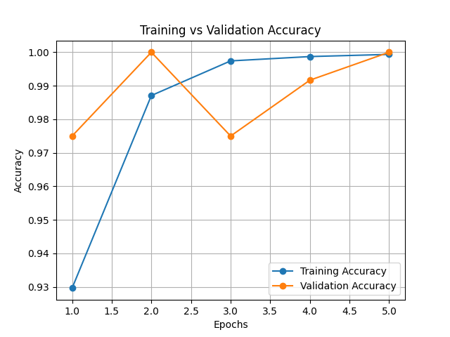
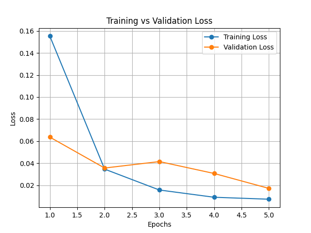

# Tomato Leaf Disease Detection using Deep Learning

# Project Overview
This project detects diseases in tomato leaves using a Deep Learning model. The system uses a Convolutional Neural Network (MobileNetV2) to classify tomato leaf images as healthy or diseased.
The model is trained on tomato leaf images and deployed using a Flask web application where users can upload a leaf image and get the prediction result.

# Technologies Used
- Python
- TensorFlow / Keras
- MobileNetV2 (Transfer Learning)
- Flask
- HTML / CSS
- Matplotlib

# Dataset
The dataset contains tomato leaf images of two classes:
- Healthy Leaves
- Early Blight Disease
The images are used to train and validate the deep learning model.

# Model Training
The model is trained using MobileNetV2 architecture with transfer learning.
Training includes:
- Image preprocessing
- Model training
- Validation accuracy evaluation
- Loss monitoring

# Training Results

# Accuracy Graph

# Loss Graph

# Project Structure
tomato_project

├── app.py  
├── train.py  
├── test_model.py  
├── tomato_disease_model.h5  
├── accuracy_graph.png  
├── loss_graph.png  
├── templates  
│   └── index.html  
├── static  
│   └── uploads  

# How to Run the Project

# 1 Install Dependencies
pip install tensorflow flask numpy opencv-python matplotlib

# 2 Train the Model
python train.py

# 3 Run Flask App
python app.py

# 4 Open in Browser
http://127.0.0.1:5000/

Upload a tomato leaf image to detect disease.

# Future Improvements
- Add more disease classes
- Improve model accuracy
- Deploy the system online
- Build a mobile application

# Author
Shejal Thakur
